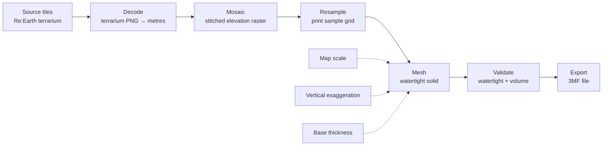

# Data Pipeline

terranejs turns a region you pick on a map into a wall-mountable,
3D-printed topography tile: a physical relief square whose surface height
tracks the real terrain, scaled down to fit a print bed. This is the
end-to-end path from raw elevation data to a slicer-ready model file.

## Key terms

- **Source tile** — one elevation PNG from the data source, addressed by Web
  Mercator zoom/x/y like a map tile. Re:Earth serves elevation as 512×512-px
  "@2×" tiles; terranejs reads the native 256-px quadrant it needs. (The
  watermask is a plain 256×256-px tile.)
- **Mosaic** — the single elevation raster produced by decoding and
  stitching together every source tile covering the region.
- **Grid** — the regular lattice of sample points, sized to the chosen
  print, that the mesh is actually built from (not the mosaic's raw pixel
  grid).
- **Tile** (the product) — the physical 3D-printed square this whole
  pipeline produces. Not to be confused with a *source tile*.

## 1. Data source

Elevation and water extent come from **Re:Earth Terrain** (Mapterhorn),
terrarium-encoded PNG tiles addressed as standard Web Mercator z/x/y tiles.
Each pixel's red, green, and blue channels encode one elevation sample in
metres (`elevation = R×256 + G + B/256 − 32768`); decoding a tile means
reading its pixels and applying that formula. Full source details, the
watermask tile, and attribution are in
[`data-sources.md`](data-sources.md).

## 2. Choosing detail

Printers have a practical resolution floor — consumer machines can't
reliably repeat much finer than about 0.05 mm — so elevation data more
detailed than that floor, once projected through the print's scale, buys
nothing but bigger downloads and slower meshing. terranejs picks the
shallowest source zoom level whose ground resolution, at the chosen map
scale, lands at or below that floor, capped by the source's deepest
available zoom and by a tile-count budget so a very large region degrades
to a coarser zoom instead of fetching thousands of tiles.

The live preview goes coarser still: the screen shows far less detail than the
print, so a smaller tile budget bakes a faster, lighter mesh that looks identical
on-screen. Only the exported model uses the full budget.

## 3. Fetch + assemble

Given the region and the chosen zoom, terranejs works out which source
tiles cover it, fetches them concurrently, decodes each to metres, and
stitches the results into one elevation raster in a shared pixel space —
the **mosaic**. This is the raw material every later stage samples from.

## 4. Resample

The mesh isn't built straight from mosaic pixels — it's built from the
print's own sample grid, a lattice sized to the tile's footprint and map
scale. terranejs snaps that grid to whole mosaic pixels, so each grid point
lands on exactly one pixel: resampling reduces to a direct read, and
adjacent tiles that share an edge sample identical seam data by
construction.

## 4a. Water handling

Water (ocean + lakes + rivers) is masked from the Re:Earth **watermask** tile, fetched at the
same bbox and zoom as the elevation mosaic — pixel-aligned, so no detection or flood-fill is
needed. Rather than flatten water to absolute sea level (which holes high lakes and colours low
land blue), terranejs anchors to the tile's **own lowest water**:

1. Fetch the watermask mosaic and threshold its alpha (`alpha > 127` = water) to a boolean mask
   over the bake grid.
2. Read the grid's lowest water and lowest land, then flatten the low water to one floor a recess
   below the land, and place the water→land colour line just above that floor. The lowest water
   prints blue; terrain bands up from there. Which water gets flattened is gated a bounded distance
   above the lowest water — a fixed minimum, widened by the recess slider — so a bigger recess
   reaches higher and pulls more of the tile's water (a reservoir sitting above a river) down to
   the same blue floor; water past the gate stays at its elevation, coloured as terrain.
3. **Auto** (default) sizes the recess automatically: just enough to drop the colour line below
   the lowest land, capped by the *Max recess* slider. On an ordinary coast (land at or above the
   water) that need is already covered by a small fixed floor, so the slider changes nothing — it
   only matters once land dips well below the water and clearing it would take more recess than
   the cap allows. When that happens (a deep valley under a small lake), Auto refuses to blue the
   land instead: it caps the colour line at the lowest land, so that water prints as ordinary
   terrain rather than bleeding blue onto the valley — raising *Max recess* clears the land and
   lets the water blue again. **Manual** sets the recess (mm) directly with no such cap, warning
   instead when low land would print blue.

So a mountain lake becomes the tile's blue base with peaks banding above it; a coast gets blue
ocean with green land; below-sea-level polders stay green above a recessed blue channel. Lakes and
ocean are treated alike — the mask doesn't distinguish them. See
`docs/superpowers/specs/2026-07-23-water-anchor-recess-design.md`.
Inland land below sea level (e.g. Death Valley) is unmasked, so it's
preserved as real terrain.

The colour line becomes `thresholds[0]` in §8's band array (the ecological lines clamp up to it,
staying ascending), so it drives the same per-print-Z filament changes as any other band boundary
— no separate colour path. `emin` follows the recess floor, so the base filament is water — except
in Auto's give-up case above, where the tile's true low point is the uncleared land instead.

## 5. Mesh

The elevation grid becomes a watertight 3D solid with three parts: a
raised **top surface** following the elevation grid, **side walls**
closing the gap between that surface's outer edge and the base, and a
flat **base** underneath.

Three settings shape the result:

- **Map scale** (1:N) — how many real-world metres one print millimetre
  represents; sets both the tile's footprint size and how much the
  elevation range shrinks.
- **Vertical exaggeration** — a multiplier on relief height only,
  independent of the horizontal scale, so terrain that would otherwise be
  imperceptibly shallow at print size reads clearly.
- **Base thickness** — flat stock added below the lowest point of the
  terrain, so thin edges stay structurally sound and the tile has a flat
  back to mount.

## 6. Validate

Before export, the solid is checked for two things a slicer requires:
that it's **watertight** (a fully closed surface, with no gaps) and that
it has **positive volume** (not degenerate or inside-out). A tile that
fails either check is rejected rather than handed to a slicer that can't
make sense of it.

## 7. Export

The validated solid is written out as a **3MF** file — a standard,
ZIP-based 3D model container that slicer software reads to generate
printer instructions. Export is monochrome by default: one uncolored
solid per tile — with an option to embed altitude color-change
instructions (§8) for a color-banded print.

## 8. Color bands (altitude)

Terrain is shaded into a few discrete altitude bands — water, forest,
tundra, rock, snow — whose boundaries track the timberline and snowline.
Those lines fall with latitude (a tropical peak stays green far higher than
an arctic one), so the bands adjust to where a tile sits on the globe. The
preview always shows them, colored by **print height**: because a tile's
height *is* scaled elevation, each band boundary is a fixed print-Z, and
everything below it — top surface, walls, and base — reads in that band's
color.

That same fact makes the bands printable on a single-extruder machine.
Export stays monochrome by default, but the color-changes option writes each
band boundary as a filament-change-by-height instruction (a PrusaSlicer
color change / `M600`) at its print-Z; the operator swaps filament at those
heights to get an altitude-banded print with no multi-material hardware. So the
changes actually load, the coloured `.3mf` is written as a minimal PrusaSlicer
*project* (a settings-free config stub) — PrusaSlicer only reads colour changes
from a file it recognises as a project, not a bare geometry import. The band
model lives in `src/core/colors.js` and is deliberately approximate — a
good-enough hypsometric look, not a climate dataset.

## 9. Preview + UI

The website wraps this pipeline in an interactive loop: pick a region on a map
(Leaflet), adjust print settings, watch a live 3D preview (three.js) re-bake and
re-render as you go, then export — which reruns the same pipeline at full print
resolution and downloads the resulting 3MF. The preview bakes at a lower,
viewport-matched detail level than the export, and lands in two passes: a coarse
mesh almost immediately, then a sharper one a moment later.

The pipeline itself is headless — it lives in `src/core/`, has no DOM
dependency, and is testable outside a browser. The browser-facing pieces
(map, preview, settings controls, the page itself) live in `src/ui/` and
never bake anything themselves; they only call into the core pipeline and
render what it returns. That baking runs on a background worker thread — which also computes the
per-vertex normals the preview needs for lighting, so nothing meshes them on the
main thread — leaving the interface responsive even while a tile is built, and
letting the sharper pass carry more detail without stalling the page.

## 10. Coordinate model

Geometry throughout this pipeline is computed in **Web Mercator**, a flat
projection of the Earth — not a curved or true-Earth model. Web Mercator
cannot represent the poles, so its coverage stops at roughly ±85° latitude;
a region reaching beyond that band has no source tiles and is rejected up
front rather than exported. A curved-shell, true-Earth coordinate model is a
potential future feature.
