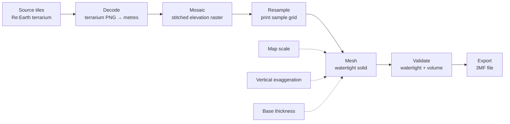

# Data Pipeline

terranejs turns a region you pick on a map into a wall-mountable,
3D-printed topography tile: a physical relief square whose surface height
tracks the real terrain, scaled down to fit a print bed. This is the
end-to-end path from raw elevation data to a slicer-ready model file.

```mermaid
flowchart LR
    A[Source tiles<br/>Re:Earth terrarium] --> B[Decode<br/>terrarium PNG → metres]
    B --> C[Mosaic<br/>stitched elevation raster]
    C --> D[Resample<br/>print sample grid]
    D --> E[Mesh<br/>watertight solid]
    E --> F[Validate<br/>watertight + volume]
    F --> G[Export<br/>3MF file]

    S1[Map scale] -.-> E
    S2[Vertical exaggeration] -.-> E
    S3[Base thickness] -.-> E
```

## Key terms

- **Source tile** — one elevation PNG from the data source, addressed by Web
  Mercator zoom/x/y like a map tile. Re:Earth serves elevation as 512×512-px
  "@2×" tiles; terranejs reads the native 256-px quadrant it needs. (The
  watermask is a plain 256×256-px tile.)
- **Mosaic** — the single elevation raster produced by decoding and
  stitching together every source tile covering the region.
- **Grid** — the regular lattice of sample points, sized to the chosen
  print, that the mesh is actually built from (not the mosaic's raw pixel
  grid).
- **Tile** (the product) — the physical 3D-printed square this whole
  pipeline produces. Not to be confused with a *source tile*.

## 1. Data source

Elevation and water extent come from **Re:Earth Terrain** (Mapterhorn),
terrarium-encoded PNG tiles addressed as standard Web Mercator z/x/y tiles.
Each pixel's red, green, and blue channels encode one elevation sample in
metres (`elevation = R×256 + G + B/256 − 32768`); decoding a tile means
reading its pixels and applying that formula. Full source details, the
watermask tile, and attribution are in
[`data-sources.md`](data-sources.md).

## 2. Choosing detail

Printers have a practical resolution floor — consumer machines can't
reliably repeat much finer than about 0.05 mm — so elevation data more
detailed than that floor, once projected through the print's scale, buys
nothing but bigger downloads and slower meshing. terranejs picks the
shallowest source zoom level whose ground resolution, at the chosen map
scale, lands at or below that floor, capped by the source's deepest
available zoom and by a tile-count budget so a very large region degrades
to a coarser zoom instead of fetching thousands of tiles.

The live preview goes coarser still: the screen shows far less detail than the
print, so a smaller tile budget bakes a faster, lighter mesh that looks identical
on-screen. Only the exported model uses the full budget.

## 3. Fetch + assemble

Given the region and the chosen zoom, terranejs works out which source
tiles cover it, fetches them one at a time, decodes each to metres, and
stitches the results into one elevation raster in a shared pixel space —
the **mosaic**. This is the raw material every later stage samples from.
The fetch is deliberately serial: the tile hosts are free, shared
infrastructure, and a preview needs only a tile or two. Elevation and
watermask are fetched as two independent passes that overlap each other,
so a bake holds at most two connections open.

## 4. Resample

The mesh isn't built straight from mosaic pixels — it's built from the
print's own sample grid, a lattice sized to the tile's footprint and map
scale. terranejs snaps that grid to whole mosaic pixels, so each grid point
lands on exactly one pixel: resampling reduces to a direct read, and
adjacent tiles that share an edge sample identical seam data by
construction.

### Tile footprints

A tile prints as a square, a flat-top hexagon, or a circle. All three share one pixel window
and one elevation grid. Squares fill their window exactly. Hexagons and circles apply a
boundary — hexagons via a **cell mask** that stairs, circles via clipping to the true circle.

- `layout.footprintPx` returns the footprint ring in global pixels — 6 vertices for a hexagon
  (on a half-unit integer lattice, so a vertex shared by two adjacent hexes is bit-identical),
  64 for a circle, and `null` for a square, which fills its window and needs no clip.
- `layout.footprintCellMaskPx` rasterises that ring by scanline at cell centres, decided in
  global pixel coordinates so adjacent tiles reach the same verdict for a shared cell and
  never double-claim a seam.
- `mesh.buildSolid` applies the boundary (hexagon cell mask or circle clip), builds the
  top surface, then closes it into a watertight solid with a skirt and flat base. Squares need
  neither mask nor clip; they fill the window outright.

**Circles are clipped to the true circle.** `clip.clipCircle` intersects the circle with the
grid: boundary cells are cut rather than taken whole, and the rim follows the circle instead
of the cell lattice. Crossings are keyed by grid edge so the two cells sharing an edge
resolve one vertex id — that is what keeps the clipped surface free of interior boundary,
and hence watertight. Because every crossing sits exactly on the circle, the printed
footprint is an inscribed polygon whose area deficit is ~1e-7 relative; the cell-centre mask
it replaced measured 0.78387 of the bounding box against π/4 = 0.78540.

Elevation at a rim crossing is linear along its edge — the interior's piecewise-linear
surface sampled at the boundary — so `emin`/`emax` are taken over inside samples **plus**
crossing elevations. `emin` sets the base plane, and a crossing interpolated toward a lower
outside sample can sit below every inside sample; statistics that missed it would put the
surface under its own base.

**Hexagons still stair, and unevenly.** From the ring offsets (`layout.js:41-42`) a flat-top
hex has two constant-y edges that land flush on cell rows and cut clean, and four edges at
60° (Δy/Δx = √3) that stair, jogging about every other row. Two smooth faces and four
stepped ones is wrong at any resolution — the inconsistency is the defect, not the step size
(~0.12 mm at export, under both nozzle width and layer height). Clipping them is deferred:
hexes tile, so neighbouring tiles must agree on a shared edge's height profile, which
circles never need (`NEIGHBORS.circle` is empty).

**`tileWmm` is the bounding-square side** — the largest dimension — in every shape, so a tile
always fits the same bed envelope. Enclosed area therefore differs by shape:

| Shape  | Printed bbox at 200 mm | Area | vs. square |
| ------ | ---------------------- | ---- | ---------- |
| Square | 200 × 200 mm | 40000 mm² | 100% |
| Circle | 200 × 200 mm | 31365 mm² | 78.4% (≈π/4) |
| Hex    | 200 × 173.2 mm | 25981 mm² | 65.0% (3√3/8) |

**Statistics are computed over the footprint, not the window.** A hexagon discards 25% of its
own window and a circle 21.6% (window-relative — a different frame from the table's vs.-square
column above). That terrain never reaches the print, so it must not set `emin`/`emax`
(the base plane and the altitude colour bands) or the waterline. For hexagons, `layout.vertexMaskFromCells`
derives a vertex footprint from the cell mask — a vertex counts when **any** of its ≤4 incident
cells is set, since requiring all four would drop the rim vertices the skirt is built from — and
`resample.gridRange` and `water.applyWaterRecess` both skip samples outside it. For circles,
the footprint comes from `clip.inside` and statistics from `clipRange` (§105–109 above). The square path
passes no footprint and uses the full window.

## 4a. Water handling

Water (ocean + lakes + rivers) is masked from the Re:Earth **watermask** tile, fetched at the
same bbox and zoom as the elevation mosaic — pixel-aligned, so no detection or flood-fill is
needed. Colour is per-print-Z, so water reads blue only at or below the water/land colour line;
two orthogonal controls decide where the water and that line sit:

1. **Recess all water to lowest waterline** (checkbox, default off). Off: the terrain is
   untouched and the colour line sits at 0 m exactly — classic sea-level tint at any map scale.
   Ocean prints blue; land above sea level prints as terrain, however low; land at/below the
   line (polders) prints blue, with a warning naming the checkbox as the fix. On: every masked
   cell is pulled down to one plane two print layers below the lowest land — `min(lowest water,
   lowest land − 2 layers)` — and the line sits at that plane, so every water body prints blue
   and land never does. Flattening is unbounded by design: a reservoir far above a river drops
   all the way to the shared plane.
2. **Water recess** (slider, 0–5 mm). Sinks all water that much further in print space without
   moving the colour line — a groove between water and land. With the checkbox off, a large
   recess can sink even high water below the sea-level line — blue pits where lakes were;
   documented, not guarded.

A tile with no masked water gets no water line at all: waterless below-sea-level land (Death
Valley) prints as ordinary terrain.

The colour line becomes `thresholds[0]` in §8's band array (the ecological lines clamp up to it,
staying ascending), so it drives the same per-print-Z filament changes as any other band
boundary — no separate colour path. The **exported** water pause alone is lifted one print layer
(Advanced layer-height setting, default 0.15 mm) above the line, so the water's top layer prints
blue before the swap — a sub-layer offset the preview and warning do not carry, since they show
the true line. With the base thickness divisible by the layer height, that pause lands exactly
on the first land layer of an ocean-floor tile. See
`docs/superpowers/specs/2026-08-01-water-plane-simplification-design.md`.

## 5. Mesh

The elevation grid becomes a watertight 3D solid with three parts: a
raised **top surface** following the elevation grid, **side walls**
closing the gap between that surface's outer edge and the base, and a
flat **base** underneath.

Three settings shape the result:

- **Map scale** (1:N) — how many real-world metres one print millimetre
  represents; sets both the tile's footprint size and how much the
  elevation range shrinks.
- **Vertical exaggeration** — a multiplier on relief height only,
  independent of the horizontal scale, so terrain that would otherwise be
  imperceptibly shallow at print size reads clearly.
- **Base thickness** — flat stock added below the lowest point of the
  terrain, so thin edges stay structurally sound and the tile has a flat
  back to mount.

## 6. Validate

Before export, the solid is checked for two things a slicer requires:
that it's **watertight** (a fully closed surface, with no gaps) and that
it has **positive volume** (not degenerate or inside-out). A tile that
fails either check is rejected rather than handed to a slicer that can't
make sense of it.

## 7. Export

The validated solid is written out as a **3MF** file — a standard,
ZIP-based 3D model container that slicer software reads to generate
printer instructions. Export is monochrome by default: one uncolored
solid per tile — with an option to embed altitude color-change
instructions (§8) for a color-banded print.

## 8. Color bands (altitude)

Terrain is shaded into a few discrete altitude bands — water, forest,
tundra, rock, snow — whose boundaries track the timberline and snowline.
Those lines fall with latitude (a tropical peak stays green far higher than
an arctic one), so the bands adjust to where a tile sits on the globe. The
preview always shows them, colored by **print height**: because a tile's
height *is* scaled elevation, each band boundary is a fixed print-Z, and
everything below it — top surface, walls, and base — reads in that band's
color.

That same fact makes the bands printable on a single-extruder machine.
Export stays monochrome by default, but the color-changes option writes each
band boundary as a filament-change-by-height instruction (a PrusaSlicer
color change / `M600`) at its print-Z; the operator swaps filament at those
heights to get an altitude-banded print with no multi-material hardware. So the
changes actually load, the coloured `.3mf` is written as a minimal PrusaSlicer
*project* (a settings-free config stub) — PrusaSlicer only reads colour changes
from a file it recognises as a project, not a bare geometry import. The band
model lives in `src/core/colors.js` and is deliberately approximate — a
good-enough hypsometric look, not a climate dataset.

## 9. Preview + UI

The website wraps this pipeline in an interactive loop: pick a region on a map
(Leaflet), adjust print settings, watch a live 3D preview (three.js) re-bake and
re-render as you go, then export — which reruns the same pipeline at full print
resolution and downloads the resulting 3MF. The preview bakes at a lower,
viewport-matched detail level than the export, and lands in two passes: a coarse
mesh almost immediately, then a sharper one a moment later.

The pipeline itself is headless — it lives in `src/core/`, has no DOM
dependency, and is testable outside a browser. The browser-facing pieces
(map, preview, settings controls, the page itself) live in `src/ui/` and
never bake anything themselves; they only call into the core pipeline and
render what it returns. That baking runs on a background worker thread — which also computes the
per-vertex normals the preview needs for lighting, so nothing meshes them on the
main thread — leaving the interface responsive even while a tile is built, and
letting the sharper pass carry more detail without stalling the page.

## 10. Coordinate model

Geometry throughout this pipeline is computed in **Web Mercator**, a flat
projection of the Earth — not a curved or true-Earth model. Web Mercator
cannot represent the poles, so its coverage stops at roughly ±85° latitude;
a region reaching beyond that band has no source tiles and is rejected up
front rather than exported. A curved-shell, true-Earth coordinate model is a
potential future feature.
