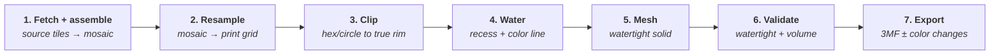

# Data Pipeline

terranejs turns a region you pick on a map into a wall-mountable,
3D-printed topography tile: a physical relief square whose surface height
tracks the real terrain, scaled down to fit a print bed. This is the
end-to-end path from raw elevation data to a slicer-ready model file.

## Key terms

- **Source tile** — one elevation PNG from the data source, addressed by Web
  Mercator zoom/x/y like a map tile. Re:Earth serves elevation as 512×512-px
  "@2×" tiles; terranejs reads the native 256-px quadrant it needs. (The
  watermask is a plain 256×256-px tile.)
- **Mosaic** — the single elevation raster produced by decoding and
  stitching together every source tile covering the region.
- **Grid** — the regular lattice of sample points, sized to the chosen
  print, that the mesh is actually built from (not the mosaic's raw pixel
  grid).
- **Tile** (the product) — the physical 3D-printed square this whole
  pipeline produces. Not to be confused with a *source tile*.

## Data source

Elevation and water extent come from **Re:Earth Terrain** (Mapterhorn),
terrarium-encoded PNG tiles addressed as standard Web Mercator z/x/y tiles.
Each pixel's red, green, and blue channels encode one elevation sample in
meters (`elevation = R×256 + G + B/256 − 32768`); decoding a tile means
reading its pixels and applying that formula. Full source details, the
watermask tile, and attribution are in
[`data-sources.md`](data-sources.md).

## Coordinate model

Geometry throughout this pipeline is computed in **Web Mercator**, a flat
projection of the Earth — not a curved or true-Earth model. Web Mercator
cannot represent the poles, so its coverage stops at roughly ±85° latitude;
a region reaching beyond that band has no source tiles and is rejected up
front rather than exported. A curved-shell, true-Earth coordinate model is a
potential future feature.

## Resolution floor

Printers have a practical resolution floor — consumer machines can't
reliably repeat much finer than about 0.05 mm — so elevation data more
detailed than that floor, once projected through the print's scale, buys
nothing but bigger downloads and slower meshing. terranejs picks the
shallowest source zoom level whose ground resolution, at the chosen map
scale, lands at or below that floor, capped by the source's deepest
available zoom and by a tile-count budget so a very large region degrades
to a coarser zoom instead of fetching thousands of tiles.

The live preview goes coarser still: the screen shows far less detail than the
print, so a smaller tile budget bakes a faster, lighter mesh that looks identical
on-screen. Only the exported model uses the full budget.

The tile budget is a ceiling on the fetch, not a target for the mesh, and **how many
tiles a zoom costs depends on how many source-tile borders the region straddles, not
on how big it is**. A region smaller than one tile still needs two if it lies across a
border. So the budget's *shape* decides whether it controls resolution at all: a
budget of one tile requires the region to miss every border, which is a property of
where it sits rather than what it needs, and has no lower bound — a region straddling
a border the grid keeps refining through is forced coarser and coarser until the tile
is a fraction of a pixel and cannot be meshed.

A budget of four fixes that structurally, because four permits a 2×2 box: a region
narrower than the tile spacing touches at most two tiles per axis, so the budget is
satisfied *wherever* it sits, and the search stops at the deepest such zoom. That
bounds the result from below at roughly half a tile. Three is not enough and two is
worse — both still require dodging a border outright on one axis. The preview tiers
budget in squares for this reason.

# Pipeline stages

```mermaid
flowchart LR
    A[<b>1. Fetch + assemble</b><br/><i>source tiles → mosaic</i>] --> B[<b>2. Resample</b><br/><i>mosaic → print grid</i>]
    B --> C[<b>3. Clip</b><br/><i>hex/circle to true rim</i>] --> D[<b>4. Water</b><br/><i>recess + color line</i>]
    D --> E[<b>5. Mesh</b><br/><i>watertight solid</i>] --> F[<b>6. Validate</b><br/><i>watertight + volume</i>]
    F --> G[<b>7. Export</b><br/><i>3MF ± color changes</i>]
```

## 1. Fetch + assemble

Given the region and the chosen zoom, terranejs works out which source
tiles cover it, fetches them one at a time, decodes each to meters, and
stitches the results into one elevation raster in a shared pixel space —
the **mosaic**. This is the raw material every later stage samples from.
The fetch is deliberately serial: the tile hosts are free, shared
infrastructure, and a preview needs only a tile or two. Elevation and
watermask are fetched as two independent passes that overlap each other,
so the raster fetch holds at most two connections open.

The detailed preview pass starts a third, optional fan alongside those two:
**source provenance** — Mapterhorn's coverage polygons and its source
catalog, from hosts separate from the elevation tiles (see "Provenance" in
[`data-sources.md`](data-sources.md)). It is never awaited: the mesh posts
without it and provenance follows on its own message, so a hung provenance
host costs the bake nothing. It feeds only the preview's hover probe; the
export path never fetches it.

## 2. Resample

The mesh isn't built straight from mosaic pixels — it's built from the
print's own sample grid, a lattice sized to the tile's footprint and map
scale. terranejs snaps that grid to whole mosaic pixels, so each grid point
lands on exactly one pixel: resampling reduces to a direct read, and
adjacent tiles that share an edge sample identical seam data by
construction.

## 3. Clip

A tile prints as a square, a flat-top hexagon, or a circle. All three share one pixel window
and one elevation grid; they differ only at the boundary. A square's rim IS its window, so it
needs no boundary work. Hexagons and circles carry a **footprint ring** — 6 vertices, or an
adaptive n-gon — and one shared clipper cuts the grid to that ring, so the printed rim follows
the true shape instead of the cell lattice. In code: `layout.footprintPx` (the ring) →
`clip.clipPolygon` (inside mask + boundary crossings) → `mesh.buildSolid` (boundary-cell
polygons fanned into the watertight solid).

**Why clip instead of mask.** The earlier design rasterised the ring to one bit per cell,
which constrains the boundary to run along cell edges. A flat-top hex then printed two clean
faces (its horizontal edges land on cell rows) and four stepped ones (its 60° edges jog every
other row) — wrong at any resolution, because the defect is the inconsistency, not the step
size. Clipping cuts boundary cells to the ring itself, at sub-cell resolution.

**Why one clipper for both shapes.** Hexes add a requirement circles never have: hexes tile,
so neighboring tiles must agree **bit-for-bit** on a shared edge or a multi-tile print grows
a seam. Rather than a hex-specific path, the single convex-polygon clipper hardens that
guarantee into its geometry — a circle is just a ring with more vertices:

- Crossings are computed once into a table keyed by **grid edge, never by cell**: the two
  cells sharing an edge resolve the same vertex, which keeps the surface free of interior
  boundary. (Clipping each cell independently would emit coincident-but-distinct vertices
  and build a wall through the tile.)
- All boundary geometry **snap-rounds to a 1/256-cell lattice in global pixels**. A lattice,
  unlike an epsilon threshold, is transitive and order-independent — no tolerance comparison
  exists anywhere in the clipper.
- Arithmetic is **canonicalised**: edge endpoints are ordered before intersecting and sums
  are evaluated in the global frame, so a shared crossing computes to the same bits whichever
  tile computes it, in either traversal direction.
- Boundary-cell polygons are assembled by **convex hull**, not an angle sort: snapping moves
  each point independently, so the collected set is only approximately convex — a hull
  tolerates that where a sort silently self-intersects.

Consequences of clipping:

- **Windows expand outward** past the ring instead of rounding: a ring's extremes coincide
  with its window bounds, so rounding inward would cut a corner — or a whole flat hex edge —
  out of the grid, asymmetrically between the two tiles sharing it.
- **Circle resolution adapts to the grid** (16 ≤ n ≤ 256, ring edges ≈ 2 cells). A fixed n is
  wrong at both ends: a preview-tier grid has fewer vertices than a fine n-gon, while export
  visibly facets a coarse one. The cap is where accuracy saturates — ~7 µm deviation from the
  true circle on a 200 mm tile, far under a nozzle width. The printed circle is the n-gon
  (area deficit 2.5% at the n=16 floor, 0.01% at the cap).
- **Statistics cover the footprint, not the window.** Terrain outside the ring never prints,
  so it must not set the base plane, the color bands, or the waterline. The elevation range
  scans inside samples plus the rim crossings' interpolated elevations — a crossing
  interpolated toward a lower outside sample can sit below every inside sample, and missing
  it would put the surface under its own base. Hex statistics shifted slightly when this
  replaced the mask-derived footprint: the intended consequence of printing the true rim.
- **Edits, unlike statistics, cover the whole window.** A rim vertex is interpolated from the
  grid on both sides of the ring, so anything that moves terrain — the water recess above all —
  has to move it outside the ring as well. Editing only the inside builds a step along exactly
  the line the rim samples across, and the rim then climbs it: water recessed inside the ring
  but left raw outside it lifts the rim back to the original waterline, as a wall around the
  tile's edge. Measure inside the footprint; edit across the window.
- **`tileWidthMm` stays the bounding-square side in every shape**, so any tile fits the same bed
  envelope; enclosed area differs — square 100%, circle → π/4 ≈ 78.5%, hex 3√3/8 ≈ 65%.

## 4. Water

Water (ocean + lakes + rivers) is masked from the Re:Earth **watermask** tile, fetched at the
same bbox and zoom as the elevation mosaic — pixel-aligned, so no detection or flood-fill is
needed. Color is per-print-Z, so water reads blue only at or below the water/land color line.
One choice decides what happens to that water; the groove depth sits under Advanced. Three cards:

| choice | color line sits at | what moves | builds parts |
|---|---|---|---|
| Natural | the tile's waterline: 0 m, rising to a lake all land clears, dropping below polder land | nothing | — |
| Lake inserts | 0 m, dropping below polder land | bodies whose interior sits above the color change | yes |
| Lake & sea inserts | — (no line, no pause) | all water | yes |

A fourth mode, `flat` (all water pulled to one plane the color band paints), is retired from the
panel: an old `mode=flat` link opens as Natural, because decode maps the mode to `none` before the
UI ever sees it. Core still accepts and builds `flat` for headless callers — the mechanism just has
no card that can select it.

**Natural** (leave water at true elevation) is the default: the terrain is untouched and the line
sits at 0 m — rising to the tile's lowest water only when ALL land clears that water by the same
two-print-layer margin the flatten plane kept below the lowest land. A tile whose water is all
perched above all land (Tahoe) raises the line to the lake's surface instead of printing it as
land; a tile with any land at or below its lowest water (Crater Lake's outer valleys) refuses the
rise and keeps 0 m, because a line land does not clear floods that land blue — tried, and the
flooded valleys read as a defect. Both bounds of the rise are load-bearing: it never starts
below 0 m (ocean samples are only clamped near 0, and real masks carry below-0 bathymetry noise —
a Puget Sound sounding reads −227 m — that would sink the line under the sea), and it never comes
within two lifts of land (the export pause prints one layer above the line; see the flatten
margin). Water the line cannot reach still shows as terrain and the warning routes to an inserts
card.

The line never sits above land, full stop — rather sea-as-land than land-as-sea. Land at or below
the candidate line (polders, deltas) pushes it to `landMin − 2·lift` instead, flatten's own
clearance: the polder prints as ordinary terrain and the SEA above the lowered line shows as land,
which the water warning states. Its named remedy genuinely works there, because the lowered line
also lowers the lakes-mode ceiling — under "Lake inserts" a polder tile's sea rises above the
ceiling, grooves, and becomes a part. `landBluePct` is ≈0 by construction (only land exactly AT
the line still counts, boundary-blue) and survives as a returned invariant rather than a warning:
a real percentage means the anchor broke.

**Retired: flatten to one level.** It pulls every masked cell down to one plane two print layers
below the lowest land — `min(lowest water, lowest land − 2 layers)` — and the line sits at that
plane, so every water body prints blue and land never does. The second term nearly always wins,
because the source carries no bathymetry and clamps ocean to ~0 m: the plane therefore sits BELOW
the lowest water, not at it, by 75 m on a Zeeland tile and 1794 m on a Titicaca one. Flattening is
unbounded by design — a reservoir far above a river drops all the way to the shared plane, and how
far any given body falls depends on where it started, which no single number can describe. On one
667 km Peru tile the ocean falls 0.3 mm of print while a 5009 m lake falls 6.3 mm. The panel no
longer offers it: it went unused, and its unbounded drop — correct by design — reads as a defect
in the preview. Old `mode=flat` links now open as Natural instead; only headless callers can still
build it.

**Lake & sea inserts** (recess all water) carries no color line at all: every printable body
becomes a part, so the pause that would paint sub-line layers blue is never worth its filament
swap. Grooves, outer walls and polders print as ordinary terrain, and every drop of blue on the
tile is an insert — `lineElev` is −Infinity, the waterless sentinel, so the water band folds into
the base and the legend row disappears with it. The sea's insert is the reason to choose this
over Lake inserts: its top is the original sea surface — a flat plane — so as a separate part it
can be ironed or printed in one glossy blue, where in place it is paint on terrain.

**Lake inserts** (recess water above the waterline) grooves only the bodies that would otherwise print as
terrain, and leaves the rest at true elevation.

"Would print as terrain" is a claim about the print, so the test is against the height the print
**changes color at**, not the waterline. The export lifts the water pause one layer above the line
so the water's top layer prints blue, and one layer is meters of *ground* at map scale — 45 m at
1:300,000 and exaggeration 1, since a layer buys `layerMm × scale ÷ (1000 × exag)` meters. Water
inside that layer cannot print as anything but blue however far above 0 m its sample reads, so
grooving it would buy nothing and cost a part. Both the layer-height control and the exaggeration
slider therefore move this boundary, the same way the flatten plane already moves with layer
height.

A body is grooved iff its **interior** — itself eroded one cell in from its outer ring — holds a
vertex above that height; a body with no interior cells (one cell thick, or run edge to edge
against the tile) falls back to judging its full extent instead. The erosion is a second, separate
guard, and it is needed because the elevation grid and the watermask are different products whose
coastlines disagree by a pixel or two at every shore: the outer ring samples the DEM's shore bluff,
which on a steep coast clears the color change on its own. Measured at exaggeration 1, a Sognefjord
tile's fjord reaches 47.4 m over its full extent and 10.1 m eroded against a 45 m color change, and
a Bora Bora lagoon 12.6 m and 10.5 m against 12 m — each grooves whole without the erosion and not
at all with it. Neither guard is sufficient alone: after erosion every ocean body still carries
~10–12 m of excursion from low real land inside the water polygon (motu, marsh islands, dikes),
which clears a bare 0 m line every time. Together they let a real mixed tile happen — ocean left at
the line, alpine lakes and reservoirs grooved.

The fallback stays conservative: a sliver too narrow to have an interior still grooves rather than
being silently left alone. Either way the decision remains whole-body — half a body would leave a
cliff inside the water and an insert tapering to nothing along the split, so a decisive vertex
anywhere in the chosen evidence still grooves ALL of it, shoreline included. That one vertex
decides a body of a million cells is the rule's limit: at exaggeration 4 the color change falls to
3–11 m of ground, under the residue above, and coastal tiles groove whole again. The answer there
would be a robust statistic over the body rather than a deeper erosion.

Classification measures a body's full membership, footprint or not, which is the opposite of how
the color line is measured: water outside the print must not anchor the plane, but a body left
alone whose out-of-footprint cells sat above the color change would leave the rim climbing a
cliff.

This is the mode that lets one tile carry an ocean blue by color band and lakes blue by drop-in
part. Its parts are implied, not optional: a grooving choice always bakes and exports them, so
the grooves never ship open.

`waterAsLandPct` counts only water the recess did NOT move, and counts it against the same color
change the mode above classifies by, in every mode. Water in a groove has a part to fill it, so it
is blue by part rather than showing as land — and the warning names the fix plainly: choose "Lake
inserts" to print it blue. Naming it is safe only because the fix is real; without a groove the
count would otherwise complain about a tile whose lakes are working exactly as intended. Water
under the color change is blue by band, so naming it would be a false alarm on the near-0
bathymetry noise every coastal tile carries: share of tile falls from 5.06% to 0.13% on a Puget
Sound tile and 4.50% to 0.50% on San Francisco Bay, both from over the 1% threshold to under it,
while Lake Titicaca (58%) and Crater Lake (13%) are untouched — that water really does print as
rock. Under the choices that groove nothing the count is unchanged, which is what keeps the
default tile's warning as strict as it was.

`landBluePct` keeps measuring against the true line rather than the color change, deliberately.
The two counters ask different questions: one is "will this water print as land", a question about
the print, and the other is "is there land under the waterline" — whose answer is now "no" by
construction, since the line never sits above land. It prints no sentence; it survives as an
invariant a headless caller (or a test) can check.

The **insert groove depth** (0.5–5 mm in 0.5 mm steps, default 1 mm — half a millimeter is 3–4
layers at a typical layer height) is how deep the groove is that a blue insert drops into, and so
how thick that part is. It lives in Advanced, beside layer height, because it describes how you
print rather than what the tile is: the mode is the water decision, and the depth is a preference
set once. Only the sinking modes read it. It is floored rather than allowed to reach zero, because
a zero depth cancels the mode that reads it — the card would promise grooves and deliver none.
The retired flatten mode does not read it at all: a plane sunk further was a shoreline lip, a
different intent wearing the same control, and it is gone.

Before either control runs, water too narrow to print is dropped from the mask: a body survives
only if it holds a square 0.8 mm across that is entirely water — two 0.4 mm extrusions, the width
of a free-standing part you can press into a groove. A dropped body is not recessed, not
flattened, does not anchor the flatten plane, and gets no inlay; it sits at true elevation and
prints blue only if it falls in the blue band on its own. The threshold is print millimeters, so a
wide tile keeps no rivers — 0.8 mm is 120 m of ground at 1:150,000. One filtered mask feeds both
the recess and the inlay, which is what makes them agree: the recess moves masked vertices while
the inlay meshes all-four-corners cells, so before this, water narrower than a cell was grooved
with nothing built to fill it. The tile says so when more than 20% of its water is dropped, and
the hover probe and water overlay mark those cells as one of four states — land, water printed at
the line, water dropped as too narrow to print, and water this bake grooved for an insert — so a
dropped lake and a grooved one can each be asked about directly. A checkbox under Advanced
turns the whole filter off. It sits there, and not with the water controls, because it is not
in the shared link: the water controls describe the tile, this one describes the nozzle
printing it, and someone opening the link on different hardware should get their own answer
rather than the sharer's. Advanced and Trail are the only groups that may hold a control the
hash does not carry.

The mode moves geometry, and the insert groove depth sets how far; what moves can be exported
back as separate drop-in parts — see "Water inlays" under Export.

A tile with no masked water gets no water line at all: waterless below-sea-level land (Death
Valley) prints as ordinary terrain. Lake & sea inserts returns the same no-line sentinel on every
tile — see its paragraph above.

The line is quantized to the elevation grid's own precision, so it is always a height the grid
can hold exactly. Water flattened onto the plane then sits *on* the line rather than a rounding
step above it — which matters because the color model treats "the line is the lowest printed
elevation" as the ocean-floor case and colors the base plate itself blue. A line the grid
could only round to would land above its own water and take the whole water band with it.

**Only one direction warns now: masked water above the line shows as terrain.**
`waterAsLandPct` counts it as a share of the **tile**, warning past 1% and naming "Lake inserts",
which fixes every case — a high lake gets a groove and a part, and a polder tile's sea (above its
lowered line) grooves and becomes a part the same way. The share is of the tile, not of the
water, on purpose: a bay speckled by noisy near-0 bathymetry is only ~3% of its water but ~1.5%
of its tile, while a tile whose 0.3% water is alpine tarns is 100% of its water — measured
against the water, the warning would shout at the quiet case and stay silent on the real one.
The other direction — land printing blue — no longer exists to warn about: the line never sits
above land. The count says water will "show" as land, not print: the export pause sits a layer
above the line, so water within one layer of it
still prints blue — a sub-mm offset that is tens to hundreds of meters of *elevation* at map
scale. See
`docs/superpowers/specs/2026-08-04-water-as-land-warning-design.md`.

The color line becomes `thresholds[0]` in the Color bands array below (the ecological lines clamp up to it,
staying ascending), so it drives the same per-print-Z filament changes as any other band
boundary — no separate color path. The **exported** water pause alone is lifted one print layer
(Advanced layer-height setting, default 0.15 mm) above the line, so the water's top layer prints
blue before the swap — a sub-layer offset the preview and warning do not carry, since they show
the true line. With the base thickness divisible by the layer height, that pause lands exactly
on the first land layer of an ocean-floor tile. See
`docs/superpowers/specs/2026-08-01-water-plane-simplification-design.md`.

## 5. Mesh

The elevation grid becomes a watertight 3D solid with three parts: a
raised **top surface** following the elevation grid, **side walls**
closing the gap between that surface's outer edge and the base, and a
flat **base** underneath.

Three settings shape the result:

- **Map scale** (1:N) — how many real-world meters one print millimeter
  represents; sets both the tile's footprint size and how much the
  elevation range shrinks.
- **Vertical exaggeration** — a multiplier on relief height only,
  independent of the horizontal scale, so terrain that would otherwise be
  imperceptibly shallow at print size reads clearly.
- **Base thickness** — flat stock added below the lowest point of the
  terrain, so thin edges stay structurally sound and the tile has a flat
  back to mount.

## 6. Validate

Before export, the solid is checked for two things a slicer requires:
that it's **watertight** (a fully closed surface, with no gaps) and that
it has **positive volume** (not degenerate or inside-out). A tile that
fails either check is rejected rather than handed to a slicer that can't
make sense of it. An imported trail's cord is checked the same way, and
separately: it prints as its own object, and the tile's verdict says
nothing about it.

A tile carrying a trail inset (below) is checked for two more things,
because the failure a sub-meshed channel can produce is invisible to the
first two. A seam that does not meet vertex for vertex leaves every
directed edge still paired — the tile closes, around zero volume. So a
bake with a channel in it additionally requires that the base stitched
flat rather than falling back to mirroring the top surface, and that the
footprint came out as exactly one boundary loop. Both are asked only of
those bakes: the mirror fallback is legitimate for the degenerate rims a
coarse hex or circle can produce, and demanding a flat base everywhere
would reject tiles that print today.

## 7. Export

The validated solid is written out as a **3MF** file — a standard,
ZIP-based 3D model container that slicer software reads to generate
printer instructions. Export is monochrome by default: one uncolored
solid per tile — with an option to embed altitude color-change
instructions (Color bands, below) for a color-banded print.

### Trail ribbon

An imported trail also exports as a second object in the same 3MF: a
constant-thickness cord, 1 mm × 1 mm by default, written in the tile's
own frame and placed there untranslated — seated in its channel, or
resting on the surface it was moulded to when no inset is set. Print it
separately, in a contrasting filament, and set it on the finished tile —
it self-registers, because its underside is the terrain's own surface,
not an approximation of it.

Seated rather than plated beside the tile because the placement is only
recoverable in one direction: a slicer scatters a plate with one button,
and no button puts a part back where it was measured. The preview draws
the same cord from the same bake, in red, in the same frame — one
placement, not two. The water inlays below are still plated in +Y, since
their z is the water surface they displaced rather than the tile's, and
in place they would sit inside the tile rather than on it.

The cord's width is **independent of the grid**: 0.4 mm prints as
0.4 mm on a tile whose mesh vertices are 3 mm apart. The corridor is the
set of points within half a width of the trail — the sublevel set of a
distance field, not a union of grid cells. Two consequences fall out of
that definition. Because a distance field is single-valued however many
times a path retraces itself, an out-and-back trail yields one cord
rather than two interpenetrating ones. And because the boundary is
placed by interpolation rather than by rounding to a cell, a straight
run comes out at exactly the requested width; only curvature (the end
caps, sharp turns) costs anything, and it is bounded well under a
printed layer.

Congruence is kept by subdividing each terrain cell rather than by
sampling it. Both of a cell's triangles are halves of a square split on
one diagonal, so a uniform k×k refinement lands on a plain lattice and
every sub-triangle nests exactly inside one parent — which means every
cord vertex sits on a parent triangle's own plane. Sampling the cell
bilinearly instead would be a different surface (a saddle, not two
planes) and the cord would float or dig in by up to a quarter of the
cell's twist.

k is chosen from the cord, not the tile: four sub-cells across the
requested width, so a cord already wider than that costs nothing extra,
and the fine lattice is only ever materialized in a band along the
trail. A pathologically long thin trail is capped by a triangle budget
— spent only on the part of the trail that falls on the tile, since
framing a tile around one stretch of a long import is ordinary and the
rest is never printed. If that cap would leave the lattice too coarse to
carry the width, the export refuses rather than print a corridor beaded
into islands, each island being a closed manifold on its own and so
invisible to every check downstream.

The cord stops at the last fully interior cell of a hex or circle tile.
Over a rim cell the printed top is the clipped polygon rather than two
plain triangles, so a cord there would mate with a surface that is not
what prints.

### Trail inset

**Trail inset depth** (default 0, off) cuts a channel along the trail for
the cord to seat in, instead of leaving it resting on the surface. Set it
to the cord's height and the trail finishes flush with the terrain; set it
shallower and the cord stands proud by the difference. The cord need not
be printed at all — an empty channel is a legible trail on its own, drawn
into the relief as a groove.

The channel is the cord's width plus 0.1 mm of clearance per side, and
nothing else. That clearance is not for support scarring, which printing
the cord upside down already avoids; it pays for the way FDM prints slots
undersize and bosses oversize as material flows into concave corners, so
a nominal fit binds. What is absent is a term for the grid pitch. Carving
the channel into the elevation grid would force one: a carve can only put
the channel's edge on a grid vertex, and a cell only reaches full depth
when all four of its corners are inside, so the flat floor erodes by up to
a cell from each side and has to be paid back — √2·dx per side, which at
the resolution floor is by far the larger half of a 2.6 mm channel for a 1 mm
cord, wide enough that the trail reads as a road.

Instead the channel is meshed on the same sub-lattice the cord is, and
against the same distance field, so its boundary lands on the isoline
exactly rather than snapping to a grid vertex, and its floor is the
requested width along the whole run. The two surfaces are the same
surface: the cord's underside and the channel's floor are one
interpolation of one field, so they mate by construction rather than by
two builders agreeing. And the grid is read, never written — the channel
contributes triangles to the top surface and displaces only the vertices
it owns. The tile's elevation range is therefore what it would be with no
inset at all, and so are the z-frame, the printed height, and the
elevations the color bands fall at. A carve moved all of those, by the
depth.

The channel stops short of the rim and of recessed water. It keeps one
cell further in than the cord does, because a cell carrying it has
subdivided edges and its neighbors must be retriangulated to match —
which a rim cell, whose top is a clipped polygon rather than two
triangles, cannot be. It also never lowers a vertex the water controls
**moved**, per vertex rather than per cell, or the drop-in inlay
moulded to that shore would no longer seat. Water the controls left
where it was is not a border at all: with them at rest the mask marks
terrain that happens to be wet, and a trail fording a river shows a
trail. Under **Lake inserts** that is decided per body, so on one tile
the channel crosses the ungrooved ocean and stops at the grooved
lake. The channel and the inlay read the same mask, so they cannot
disagree about which water moved. At both borders the
depth ramps to zero over the last cell rather than ending in a step,
and the cord's underside follows the same ramp, so a trail running off
the tile or across a recessed lake stays seated to where it stops.

Two things refuse an inset outright, both reported on the trail warning.
The lattice is chosen from the cord's width against a triangle budget
(Trail ribbon, above), so a long trail at a narrow width can leave it too
coarse to carry the cord — the same refusal the cord alone hits, and the
one a coarse preview tier meets first. And the channel's floor must stay
strictly above the base plate: a floor level with it is a zero-thickness
membrane, and one below it opens the bottom of the tile. That check is
taken over the channel's own boundary, which lies half a channel width
off the trail and so dips below anything sampled along the trail itself
wherever the ground falls away from it. It refuses rather than quietly
cutting a shallower channel, because a channel that is not the depth
asked for is a fit failure discovered in the slicer, or in the print. A
ford is where that check bites hardest: water the mode left alone is
normally the tile's own minimum, so crossing it cuts the thinnest ground
there is.

### Water inlays

A grooving choice **always exports the water it displaced** back as its own drop-in objects — the
parts are the choice's point, so there is no checkbox to withhold them (bare grooves for an epoxy
pour are one slicer delete away). Each part's underside is the printed water surface and its top
is that water's **original** elevation, so it is exactly the volume the recess removed. The
retired flatten mode builds none, even from an old link: its parts would fill from the plane back
to the original surface — for a sea, a very large block — duplicating what the color band
already paints. Print the parts in blue, drop them into the hollows, and the terrain is whole
again.

The settled preview draws them where they drop in,
so the tile on screen is the tile as it prints once the parts are
seated. They are drawn in a glacial aquamarine rather than the water
band's slate blue: the band is the tint the tile itself prints at sea
level, while these are separate parts a user picks filament for, and a
mountain-lake turquoise still reads as water while telling the two
apart. They ride the crisp pass only — a second full-grid snapshot and
their own mesh is worth paying once the user has stopped moving, not
on every frame of a slider drag — so the quick tier shows terrain
alone and the blue arrives with the sharp mesh.

The exported parts are not the drawn ones. Each connected piece is
dropped so its lowest point rests on z 0, which is what lets the writer
plate them side by side; seated, they keep the elevation spread of the
bodies they came from, which a bed cannot hold. One flag on the bake
picks the frame, so neither has to be reconstructed from the other.

Undersides mate for the same reason the cord's does, by a simpler route:
water bodies are wide, so an inlay keeps whole cells and reuses the
terrain's own triangulation on the same vertex ids, with the same relief
expression over the tile's own already-displaced grid. It needs no
sub-lattice — a lake is never a fraction of a cell across.
The top comes from a snapshot of the grid taken *before* the water moves
— the recess overwrites elevations in place, so a moved vertex keeps no
record of where it started.

A cell is claimed only when all four of its corners are water. The tile
crosses a shore over one cell, as a ramp from the land vertex down to
the water vertex, and top and bottom meet at that unmoved land vertex —
so an inlay covering the ramp would fill the hollow exactly but taper
to zero thickness along its whole shoreline. Conceding those cells buys
a vertical wall the slicer can print, and a groove at most one cell wide
(a 0.083 mm median at export pitch) to seat the part through.

Water bodies on one tile can sit far apart in elevation, so each
connected piece gets its own floor and rests on the plate independently.
A single shared floor would leave every piece but the lowest hanging in
mid-air — still closed, still positive-volume, so nothing downstream
would object. Pieces are labeled 8-connected, which is what makes a
per-vertex floor well defined: a vertex's four incident cells are all
mutually 8-adjacent, so no vertex can be claimed by two pieces at
different heights.

Color changes are written per print Z for the whole plate, so a cord or
an inlay exported alongside altitude bands inherits their pauses. Print
them as separate jobs, or turn bands off.

# Appendix

## Color bands (altitude)

Terrain is shaded into a few discrete altitude bands — water, forest,
tundra, rock, snow — whose boundaries track the timberline and snowline.
Those lines fall with latitude (a tropical peak stays green far higher than
an arctic one), so the bands adjust to where a tile sits on the globe. The
preview always shows them, colored by **print height**: because a tile's
height *is* scaled elevation, each band boundary is a fixed print-Z, and
everything below it — top surface, walls, and base — reads in that band's
color.

That same fact makes the bands printable on a single-extruder machine.
Export stays monochrome by default, but the color-changes option writes each
band boundary as a filament-change-by-height instruction (a PrusaSlicer
color change / `M600`) at its print-Z; the operator swaps filament at those
heights to get an altitude-banded print with no multi-material hardware. So the
changes actually load, the colored `.3mf` is written as a minimal PrusaSlicer
*project* (a settings-free config stub) — PrusaSlicer only reads color changes
from a file it recognizes as a project, not a bare geometry import. The band
model lives in `src/core/colors.js` and is deliberately approximate — a
good-enough hypsometric look, not a climate dataset.

## Preview + UI

The website wraps this pipeline in an interactive loop: pick a region on a map
(Leaflet), adjust print settings, watch a live 3D preview (three.js) re-bake and
re-render as you go, then export — which reruns the same pipeline at full print
resolution and downloads the resulting 3MF. The preview bakes at a lower,
viewport-matched detail level than the export, and lands in two passes on
separate clocks: a coarse mesh a tenth of a second after you change something,
and a sharper one once you have stopped for a couple of seconds. Keeping the
sharp pass on the *stopping*, rather than chaining it to the coarse one
finishing, is what lets a run of quick changes stay quick.

Both tiers share one bake thread, and it is never given more than one job: a
pass that comes due while a bake is running is remembered, not queued, and
posted when that bake replies — against the newest settings, which by then may
have moved again. Queueing instead would make every later pass wait behind a
result nobody is going to look at. So a burst of adjustments costs fewer bakes
than it has changes, and the mesh stays roughly one bake behind your hand
rather than falling steadily further behind. The address bar settles on the
slow clock too: it describes state you have stopped editing.

Hovering the preview raises a probe for the cell under the cursor: elevation
(a water cell's *original* elevation, which the recess no longer prints), water
or land, and — once the sharp pass lands — which source dataset supplied the
terrain there (`us1cc 1 m`), read from the provenance fan of stage 1. That line
keeps three states distinct — a source, `no source data` (no coverage polygon
there), `source unavailable` (the fetch failed) — because a silent unknown
would read exactly like ground no source covers.

A GPX trail can be imported — picked or dropped onto the map — to frame the tile
around it. The trail draws in red on the map and as a red cord in the preview, and
the tile is centered on its bounds and scaled until the footprint contains it
with a margin; print width is held fixed,
because it is a printer-bed constraint, so the map scale is what moves. The fit
is shape-aware: a hex encloses about 65% of its bounding square and a circle
about 79%, so a hex or circle always needs a wider ground extent than a square for
the same trail — how much wider follows the trail's own proportions, not that area
figure, and shrinks toward none for an elongated trail. A shared link carries the
fitted framing but not the trail — the link
is a URL fragment and cannot hold the file — and a framing that leaves part of
the trail outside the footprint is warned about, since the tile prints only what
its rim encloses.

The preview meshes the cord at the width you set, so both cord spinners re-bake
it. Its grid is coarser than the export's, and the sub-lattice is counted in
cells across the cord's width — so the coarser grid asks for *more* subdivision
to carry the same cord, and runs into the triangle allowance first. What that
costs is the longest trail it will draw, not how accurately it draws one: a very
long trail at a very narrow width can be too fine to *draw* while still
exporting at full size. That case says so, and leaves the terrain on screen —
without the trail's inset either, since the rescue re-bakes the tile with no
trail at all.

The pipeline itself is headless — it lives in `src/core/`, has no DOM
dependency, and is testable outside a browser. The browser-facing pieces
(map, preview, settings controls, the page itself) live in `src/ui/` and
never bake anything themselves; they only call into the core pipeline and
render what it returns. That baking runs on a background worker thread — which also computes the
per-vertex normals the preview needs for lighting, so nothing meshes them on the
main thread — leaving the interface responsive even while a tile is built, and
letting the sharper pass carry more detail without stalling the page.