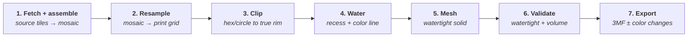

# Data Pipeline

terranejs turns a region you pick on a map into a wall-mountable,
3D-printed topography tile: a physical relief square whose surface height
tracks the real terrain, scaled down to fit a print bed. This is the
end-to-end path from raw elevation data to a slicer-ready model file.

## Key terms

- **Source tile** — one elevation PNG from the data source, addressed by Web
  Mercator zoom/x/y like a map tile. Re:Earth serves elevation as 512×512-px
  "@2×" tiles; terranejs reads the native 256-px quadrant it needs. (The
  watermask is a plain 256×256-px tile.)
- **Mosaic** — the single elevation raster produced by decoding and
  stitching together every source tile covering the region.
- **Grid** — the regular lattice of sample points, sized to the chosen
  print, that the mesh is actually built from (not the mosaic's raw pixel
  grid).
- **Tile** (the product) — the physical 3D-printed square this whole
  pipeline produces. Not to be confused with a *source tile*.

## Data source

Elevation and water extent come from **Re:Earth Terrain** (Mapterhorn),
terrarium-encoded PNG tiles addressed as standard Web Mercator z/x/y tiles.
Each pixel's red, green, and blue channels encode one elevation sample in
metres (`elevation = R×256 + G + B/256 − 32768`); decoding a tile means
reading its pixels and applying that formula. Full source details, the
watermask tile, and attribution are in
[`data-sources.md`](data-sources.md).

## Coordinate model

Geometry throughout this pipeline is computed in **Web Mercator**, a flat
projection of the Earth — not a curved or true-Earth model. Web Mercator
cannot represent the poles, so its coverage stops at roughly ±85° latitude;
a region reaching beyond that band has no source tiles and is rejected up
front rather than exported. A curved-shell, true-Earth coordinate model is a
potential future feature.

## Resolution floor

Printers have a practical resolution floor — consumer machines can't
reliably repeat much finer than about 0.05 mm — so elevation data more
detailed than that floor, once projected through the print's scale, buys
nothing but bigger downloads and slower meshing. terranejs picks the
shallowest source zoom level whose ground resolution, at the chosen map
scale, lands at or below that floor, capped by the source's deepest
available zoom and by a tile-count budget so a very large region degrades
to a coarser zoom instead of fetching thousands of tiles.

The live preview goes coarser still: the screen shows far less detail than the
print, so a smaller tile budget bakes a faster, lighter mesh that looks identical
on-screen. Only the exported model uses the full budget.

The tile budget is a ceiling on the fetch, not a target for the mesh, and **how many
tiles a zoom costs depends on how many source-tile borders the region straddles, not
on how big it is**. A region smaller than one tile still needs two if it lies across a
border. So the budget's *shape* decides whether it controls resolution at all: a
budget of one tile requires the region to miss every border, which is a property of
where it sits rather than what it needs, and has no lower bound — a region straddling
a border the grid keeps refining through is forced coarser and coarser until the tile
is a fraction of a pixel and cannot be meshed.

A budget of four fixes that structurally, because four permits a 2×2 box: a region
narrower than the tile spacing touches at most two tiles per axis, so the budget is
satisfied *wherever* it sits, and the search stops at the deepest such zoom. That
bounds the result from below at roughly half a tile. Three is not enough and two is
worse — both still require dodging a border outright on one axis. The preview tiers
budget in squares for this reason.

# Pipeline stages

```mermaid
flowchart LR
    A[<b>1. Fetch + assemble</b><br/><i>source tiles → mosaic</i>] --> B[<b>2. Resample</b><br/><i>mosaic → print grid</i>]
    B --> C[<b>3. Clip</b><br/><i>hex/circle to true rim</i>] --> D[<b>4. Water</b><br/><i>recess + color line</i>]
    D --> E[<b>5. Mesh</b><br/><i>watertight solid</i>] --> F[<b>6. Validate</b><br/><i>watertight + volume</i>]
    F --> G[<b>7. Export</b><br/><i>3MF ± color changes</i>]
```

## 1. Fetch + assemble

Given the region and the chosen zoom, terranejs works out which source
tiles cover it, fetches them one at a time, decodes each to metres, and
stitches the results into one elevation raster in a shared pixel space —
the **mosaic**. This is the raw material every later stage samples from.
The fetch is deliberately serial: the tile hosts are free, shared
infrastructure, and a preview needs only a tile or two. Elevation and
watermask are fetched as two independent passes that overlap each other,
so the raster fetch holds at most two connections open.

The detailed preview pass starts a third, optional fan alongside those two:
**source provenance** — Mapterhorn's coverage polygons and its source
catalog, from hosts separate from the elevation tiles (see "Provenance" in
[`data-sources.md`](data-sources.md)). It is never awaited: the mesh posts
without it and provenance follows on its own message, so a hung provenance
host costs the bake nothing. It feeds only the preview's hover probe; the
export path never fetches it.

## 2. Resample

The mesh isn't built straight from mosaic pixels — it's built from the
print's own sample grid, a lattice sized to the tile's footprint and map
scale. terranejs snaps that grid to whole mosaic pixels, so each grid point
lands on exactly one pixel: resampling reduces to a direct read, and
adjacent tiles that share an edge sample identical seam data by
construction.

## 3. Clip

A tile prints as a square, a flat-top hexagon, or a circle. All three share one pixel window
and one elevation grid; they differ only at the boundary. A square's rim IS its window, so it
needs no boundary work. Hexagons and circles carry a **footprint ring** — 6 vertices, or an
adaptive n-gon — and one shared clipper cuts the grid to that ring, so the printed rim follows
the true shape instead of the cell lattice. In code: `layout.footprintPx` (the ring) →
`clip.clipPolygon` (inside mask + boundary crossings) → `mesh.buildSolid` (boundary-cell
polygons fanned into the watertight solid).

**Why clip instead of mask.** The earlier design rasterised the ring to one bit per cell,
which constrains the boundary to run along cell edges. A flat-top hex then printed two clean
faces (its horizontal edges land on cell rows) and four stepped ones (its 60° edges jog every
other row) — wrong at any resolution, because the defect is the inconsistency, not the step
size. Clipping cuts boundary cells to the ring itself, at sub-cell resolution.

**Why one clipper for both shapes.** Hexes add a requirement circles never have: hexes tile,
so neighbouring tiles must agree **bit-for-bit** on a shared edge or a multi-tile print grows
a seam. Rather than a hex-specific path, the single convex-polygon clipper hardens that
guarantee into its geometry — a circle is just a ring with more vertices:

- Crossings are computed once into a table keyed by **grid edge, never by cell**: the two
  cells sharing an edge resolve the same vertex, which keeps the surface free of interior
  boundary. (Clipping each cell independently would emit coincident-but-distinct vertices
  and build a wall through the tile.)
- All boundary geometry **snap-rounds to a 1/256-cell lattice in global pixels**. A lattice,
  unlike an epsilon threshold, is transitive and order-independent — no tolerance comparison
  exists anywhere in the clipper.
- Arithmetic is **canonicalised**: edge endpoints are ordered before intersecting and sums
  are evaluated in the global frame, so a shared crossing computes to the same bits whichever
  tile computes it, in either traversal direction.
- Boundary-cell polygons are assembled by **convex hull**, not an angle sort: snapping moves
  each point independently, so the collected set is only approximately convex — a hull
  tolerates that where a sort silently self-intersects.

Consequences of clipping:

- **Windows expand outward** past the ring instead of rounding: a ring's extremes coincide
  with its window bounds, so rounding inward would cut a corner — or a whole flat hex edge —
  out of the grid, asymmetrically between the two tiles sharing it.
- **Circle resolution adapts to the grid** (16 ≤ n ≤ 256, ring edges ≈ 2 cells). A fixed n is
  wrong at both ends: a preview-tier grid has fewer vertices than a fine n-gon, while export
  visibly facets a coarse one. The cap is where accuracy saturates — ~7 µm deviation from the
  true circle on a 200 mm tile, far under a nozzle width. The printed circle is the n-gon
  (area deficit 2.5% at the n=16 floor, 0.01% at the cap).
- **Statistics cover the footprint, not the window.** Terrain outside the ring never prints,
  so it must not set the base plane, the color bands, or the waterline. The elevation range
  scans inside samples plus the rim crossings' interpolated elevations — a crossing
  interpolated toward a lower outside sample can sit below every inside sample, and missing
  it would put the surface under its own base. Hex statistics shifted slightly when this
  replaced the mask-derived footprint: the intended consequence of printing the true rim.
- **Edits, unlike statistics, cover the whole window.** A rim vertex is interpolated from the
  grid on both sides of the ring, so anything that moves terrain — the water recess above all —
  has to move it outside the ring as well. Editing only the inside builds a step along exactly
  the line the rim samples across, and the rim then climbs it: water recessed inside the ring
  but left raw outside it lifts the rim back to the original waterline, as a wall around the
  tile's edge. Measure inside the footprint; edit across the window.
- **`tileWidthMm` stays the bounding-square side in every shape**, so any tile fits the same bed
  envelope; enclosed area differs — square 100%, circle → π/4 ≈ 78.5%, hex 3√3/8 ≈ 65%.

## 4. Water

Water (ocean + lakes + rivers) is masked from the Re:Earth **watermask** tile, fetched at the
same bbox and zoom as the elevation mosaic — pixel-aligned, so no detection or flood-fill is
needed. Colour is per-print-Z, so water reads blue only at or below the water/land color line;
two orthogonal controls decide where the water and that line sit:

1. **Flatten all water to one level** (checkbox, default off). Off: the terrain is
   untouched and the color line sits at 0 m exactly — classic sea-level tint at any map scale.
   Ocean prints blue; land above sea level prints as terrain, however low; land at/below the
   line (polders) prints blue, with a warning naming the checkbox as the fix. On: every masked
   cell is pulled down to one plane two print layers below the lowest land — `min(lowest water,
   lowest land − 2 layers)` — and the line sits at that plane, so every water body prints blue
   and land never does. The second term nearly always wins, because the source carries no
   bathymetry and clamps ocean to ~0 m: the plane therefore sits BELOW the lowest water, not at
   it, by 75 m on a Zeeland tile and 1794 m on a Titicaca one. Flattening is unbounded by
   design: a reservoir far above a river drops all the way to the shared plane, and how far any
   given water body falls depends on where it started — a single number cannot describe it. On
   one 667 km Peru tile the ocean falls 0.3 mm of print while a 5009 m lake falls 6.3 mm.
2. **Water recess** (slider, 0–5 mm). Sinks all water that much further in print space without
   moving the color line — a groove between water and land. With the checkbox off, a large
   recess can sink even high water below the sea-level line — blue pits where lakes were;
   documented, not guarded.

Both controls move geometry, and what they move can be exported back as separate drop-in parts —
see "Water inlays" under Export.

A tile with no masked water gets no water line at all: waterless below-sea-level land (Death
Valley) prints as ordinary terrain.

The line is quantized to the elevation grid's own precision, so it is always a height the grid
can hold exactly. Water flattened onto the plane then sits *on* the line rather than a rounding
step above it — which matters because the colour model treats "the line is the lowest printed
elevation" as the ocean-floor case and colours the base plate itself blue. A line the grid
could only round to would land above its own water and take the whole water band with it.

**The mask and the line can disagree in both directions, and one warning covers both** — they
share the single remedy above, so the banner composes clauses into one sentence rather than
stacking. `landBluePct` counts land at/below the line, as a share of the **land**, warning past
5%. `waterAsLandPct` counts masked water above the line, as a share of the **tile**, warning
past 1%. The denominators differ on purpose: a bay speckled by noisy near-0 bathymetry is only
~3% of its water but ~1.5% of its tile, while a tile whose 0.3% water is alpine tarns is 100% of
its water — measured against the water, the warning would shout at the quiet case and stay
silent on the real one. Both are structurally 0 with the checkbox on, which is what makes the
checkbox the remedy for either. The second says water will "show" as land, not print: the export
pause sits a layer above the line, so water within one layer of it still prints blue — a sub-mm
offset that is tens to hundreds of metres of *elevation* at map scale. See
`docs/superpowers/specs/2026-08-04-water-as-land-warning-design.md`.

The color line becomes `thresholds[0]` in the Color bands array below (the ecological lines clamp up to it,
staying ascending), so it drives the same per-print-Z filament changes as any other band
boundary — no separate color path. The **exported** water pause alone is lifted one print layer
(Advanced layer-height setting, default 0.15 mm) above the line, so the water's top layer prints
blue before the swap — a sub-layer offset the preview and warning do not carry, since they show
the true line. With the base thickness divisible by the layer height, that pause lands exactly
on the first land layer of an ocean-floor tile. See
`docs/superpowers/specs/2026-08-01-water-plane-simplification-design.md`.

## 5. Mesh

The elevation grid becomes a watertight 3D solid with three parts: a
raised **top surface** following the elevation grid, **side walls**
closing the gap between that surface's outer edge and the base, and a
flat **base** underneath.

Three settings shape the result:

- **Map scale** (1:N) — how many real-world metres one print millimetre
  represents; sets both the tile's footprint size and how much the
  elevation range shrinks.
- **Vertical exaggeration** — a multiplier on relief height only,
  independent of the horizontal scale, so terrain that would otherwise be
  imperceptibly shallow at print size reads clearly.
- **Base thickness** — flat stock added below the lowest point of the
  terrain, so thin edges stay structurally sound and the tile has a flat
  back to mount.

## 6. Validate

Before export, the solid is checked for two things a slicer requires:
that it's **watertight** (a fully closed surface, with no gaps) and that
it has **positive volume** (not degenerate or inside-out). A tile that
fails either check is rejected rather than handed to a slicer that can't
make sense of it.

## 7. Export

The validated solid is written out as a **3MF** file — a standard,
ZIP-based 3D model container that slicer software reads to generate
printer instructions. Export is monochrome by default: one uncolored
solid per tile — with an option to embed altitude color-change
instructions (Color bands, below) for a color-banded print.

### Trail ribbon

An imported trail also exports as a second object in the same 3MF: a
constant-thickness cord, 1.6 mm × 0.6 mm by default, placed clear of the
tile in +Y and dropped so its lowest point sits on the plate. Print it
separately, in a contrasting filament, and set it on the finished tile —
it self-registers, because its underside is the terrain's own
triangulation on the same vertex ids, not an approximation of it.

The corridor is stamped into grid cells rather than swept along the
trail, which is what makes an out-and-back trail produce one cord
instead of two interpenetrating ones. Its edge therefore follows cell
boundaries — and the width guard refuses a cord narrower than two
grid cells, so the stair-step is at most half the cord's own width,
by construction at any pitch.

### Water inlays

**Also export water inlays** (checkbox, default off) adds the water the
tile displaced back as its own drop-in objects. Each one's underside is
the printed water surface and its top is that water's **original**
elevation — not the tile's waterline, which flatten invents — so an
inlay is exactly the volume the two water controls removed, and both
feed it: flatten's drop counts as much as the recess. With neither on,
nothing was displaced and nothing is exported. Print them in blue, drop
them into the hollows, and the terrain is whole again.

Undersides mate by the same construction as the cord: the same vertex
ids, the same relief expression, the tile's own already-displaced grid.
The top comes from a snapshot of the grid taken *before* the water moves
— flatten overwrites elevations in place, so a flattened vertex keeps no
record of where it started.

A cell is claimed only when all four of its corners are water. The tile
crosses a shore over one cell, as a ramp from the land vertex down to
the water vertex, and top and bottom meet at that unmoved land vertex —
so an inlay covering the ramp would fill the hollow exactly but taper
to zero thickness along its whole shoreline. Conceding those cells buys
a vertical wall the slicer can print, and a groove at most one cell wide
(0.1–0.6 mm at export pitch) to seat the part through.

Water bodies on one tile can sit far apart in elevation, so each
connected piece gets its own floor and rests on the plate independently.
A single shared floor would leave every piece but the lowest hanging in
mid-air — still closed, still positive-volume, so nothing downstream
would object. Pieces are labelled 8-connected, which is what makes a
per-vertex floor well defined: a vertex's four incident cells are all
mutually 8-adjacent, so no vertex can be claimed by two pieces at
different heights.

Color changes are written per print Z for the whole plate, so a cord or
an inlay exported alongside altitude bands inherits their pauses. Print
them as separate jobs, or turn bands off.

# Appendix

## Color bands (altitude)

Terrain is shaded into a few discrete altitude bands — water, forest,
tundra, rock, snow — whose boundaries track the timberline and snowline.
Those lines fall with latitude (a tropical peak stays green far higher than
an arctic one), so the bands adjust to where a tile sits on the globe. The
preview always shows them, colored by **print height**: because a tile's
height *is* scaled elevation, each band boundary is a fixed print-Z, and
everything below it — top surface, walls, and base — reads in that band's
color.

That same fact makes the bands printable on a single-extruder machine.
Export stays monochrome by default, but the color-changes option writes each
band boundary as a filament-change-by-height instruction (a PrusaSlicer
color change / `M600`) at its print-Z; the operator swaps filament at those
heights to get an altitude-banded print with no multi-material hardware. So the
changes actually load, the colored `.3mf` is written as a minimal PrusaSlicer
*project* (a settings-free config stub) — PrusaSlicer only reads color changes
from a file it recognises as a project, not a bare geometry import. The band
model lives in `src/core/colors.js` and is deliberately approximate — a
good-enough hypsometric look, not a climate dataset.

## Preview + UI

The website wraps this pipeline in an interactive loop: pick a region on a map
(Leaflet), adjust print settings, watch a live 3D preview (three.js) re-bake and
re-render as you go, then export — which reruns the same pipeline at full print
resolution and downloads the resulting 3MF. The preview bakes at a lower,
viewport-matched detail level than the export, and lands in two passes: a coarse
mesh almost immediately, then a sharper one a moment later.

Hovering the preview raises a probe for the cell under the cursor: elevation
(a water cell's *original* elevation, which the recess no longer prints), water
or land, and — once the sharp pass lands — which source dataset supplied the
terrain there (`us1cc 1 m`), read from the provenance fan of stage 1. That line
keeps three states distinct — a source, `no source data` (no coverage polygon
there), `source unavailable` (the fetch failed) — because a silent unknown
would read exactly like ground no source covers.

A GPX trail can be imported — picked or dropped onto the map — to frame the tile
around it. The trail draws in red, and the tile is centered on its bounds and
scaled until the footprint contains it with a margin; print width is held fixed,
because it is a printer-bed constraint, so the map scale is what moves. The fit
is shape-aware: a hex encloses about 65% of its bounding square and a circle
about 79%, so a hex or circle always needs a wider ground extent than a square for
the same trail — how much wider follows the trail's own proportions, not that area
figure, and shrinks toward none for an elongated trail. A shared link carries the
fitted framing but not the trail — the link
is a URL fragment and cannot hold the file — and a framing that leaves part of
the trail outside the footprint is warned about, since the tile prints only what
its rim encloses.

The pipeline itself is headless — it lives in `src/core/`, has no DOM
dependency, and is testable outside a browser. The browser-facing pieces
(map, preview, settings controls, the page itself) live in `src/ui/` and
never bake anything themselves; they only call into the core pipeline and
render what it returns. That baking runs on a background worker thread — which also computes the
per-vertex normals the preview needs for lighting, so nothing meshes them on the
main thread — leaving the interface responsive even while a tile is built, and
letting the sharper pass carry more detail without stalling the page.