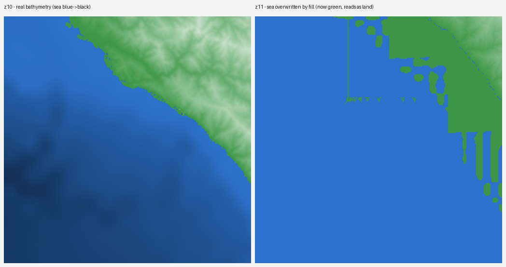

# Elevation data sources

terranejs reads elevation from the public **AWS Terrain Tiles** dataset
(Mapzen/Tilezen "terrarium" tiles), hosted on S3:

```
https://s3.amazonaws.com/elevation-tiles-prod/terrarium/{z}/{x}/{y}.png
```

- **Tiling:** Web Mercator `z/x/y`, 256×256 px per tile.
- **Encoding:** elevation packed into RGB as metres, 1/256 m steps, negative
  for bathymetry:

  ```
  elevation_m = (R * 256 + G + B / 256) - 32768
  ```

  See the [Tilezen/Joerd format docs](https://github.com/tilezen/joerd/blob/master/docs/formats.md#terrarium).
- **Attribution:** "Elevation data © Mapzen and others, hosted by AWS"
  ([registry](https://registry.opendata.aws/terrain-tiles/)) — shown in the app footer.
- **Coverage:** global, z0–z15, each zoom stitched from different sources
  (SRTM, GMTED, NED/3DEP, ETOPO1/GEBCO bathymetry, …).

Free, global, no key, CORS-enabled — a good default. The multi-source
stitching has one sharp edge: the ocean.

## Issue: coastal ocean overwritten above z10

Thresholding `elevation ≤ 0` to detect sea works at coarse zoom but fails
near coastlines above z10: the source composites a land DEM over water,
replacing real bathymetry with a flat near-sea-level fill, so shoreline
pixels decode as low *land*, not sea.

Evidence, Big Sur coast (`36.10°N, 121.66°W`): at z10 the tile decodes to a
real bathymetric gradient, min **−1475 m**; at z11 the sea floor is gone,
min **−6.9 m**, and the PNG collapses **114 KB → 14 KB** — a flat fill
compresses away the entropy real bathymetry has.



## Why, and the workaround

Each tile response carries an `x-amz-meta-x-imagery-sources` header naming
its composited source rasters. For the Big Sur column, z10 includes
`etopo1/ETOPO1_Bed_g.tif` — a global relief model with real bathymetry; z11
swaps it for `ned/…` — a high-res US **land-only** DEM with no bathymetry,
which fills water with a flat near-sea-level value. That ETOPO1→NED swap at
z11 is the fill's source.

This is global, not a US quirk: spot-checked on coasts across the Americas,
Europe, Asia, and Oceania, z10 uniformly carries ETOPO1 bathymetry while z11
drops it for a land-only source (a regional DEM, SRTM, or GMTED) with no value
over water. It also **contradicts the source's own
[documentation](https://github.com/tilezen/joerd/blob/master/docs/data-sources.md)**,
which says ETOPO1 bathymetry is composited at every zoom (oversampled even to
z15). The shipped `elevation-tiles-prod` tiles don't deliver that: above z10 the
`X-Imagery-Sources` header lists no ETOPO1, and a −4380 m open-ocean point
decodes as 0. Documented intent and actual bytes disagree — so we trust the
empirical z≤10 signal and treat z10 as the detection floor everywhere.

So ocean must never be detected on the contaminated high-zoom grid:

1. Detect ocean on a coarse (z ≤ 10) grid, where the signal is clean.
2. Flood-fill from the edges of a bbox padded beyond the tile, so seeds are
   true open sea. Interior sub-sea-level basins (e.g. Death Valley, −86 m)
   stay land as long as the padding encloses them; a basin reaching the
   *tile* edge would otherwise flood as sea.
3. Recess masked vertices to a flat shelf and discard the bathymetry — above
   z10 it's a fill, and the z≤10 sea floor is too coarse to print anyway.
